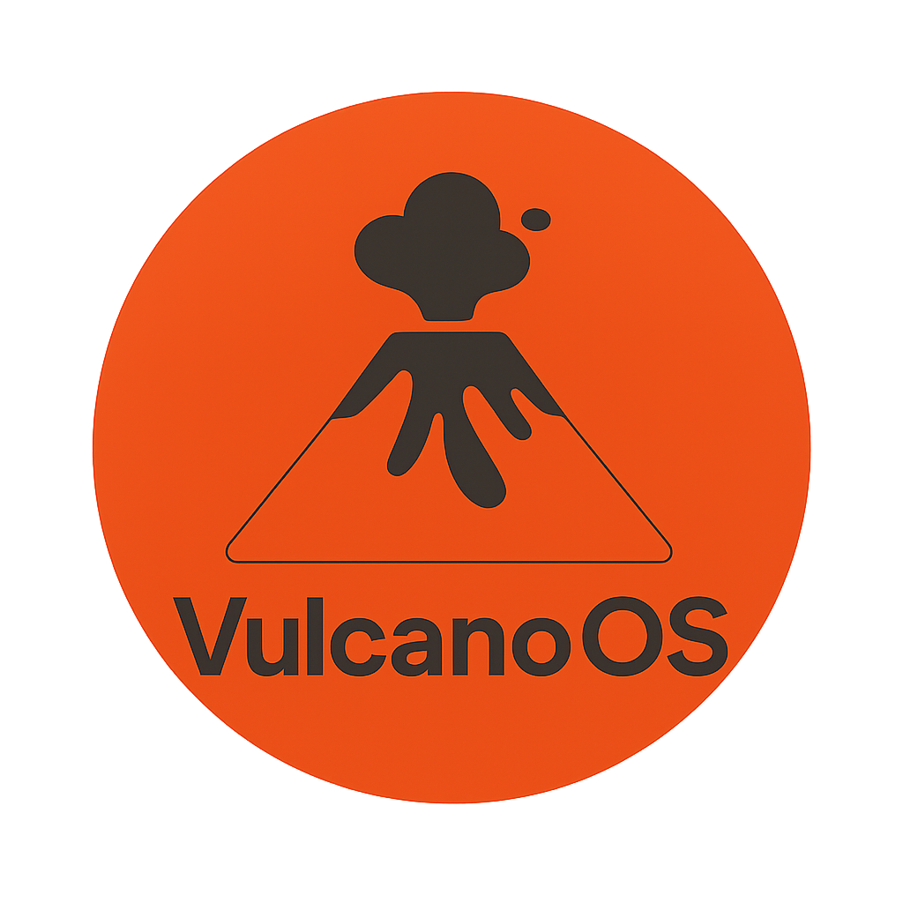

<p align="center">
  
</p>

## sobre
Esse sistema operacional é simples, feito por mim, Matheus Leme da Silva. Tenho 14 anos e sempre gostei de entender como as coisas funcionam por trás, então decidi tentar criar o meu próprio.

## dependencias
- **gcc** - Compilador C e assembly
- **ld** - Linker
- **make** - Para rodar os Makefile
- **bdftopcf** - Conversor de bdf para pcf
- **sfdisk** - Para lidar com as partições da imagem
- **mtools** - Para lidar com fat
- **truncate** - Para lidar com tamanhos de arquivos mais facilmente
- **dd** - Para copias

### Opcional
- **qemu** - Para fazer testar

## compilando
```bash
make all

# Para testar
make qemu
```

## licença
[Licença MIT](LICENSE)

